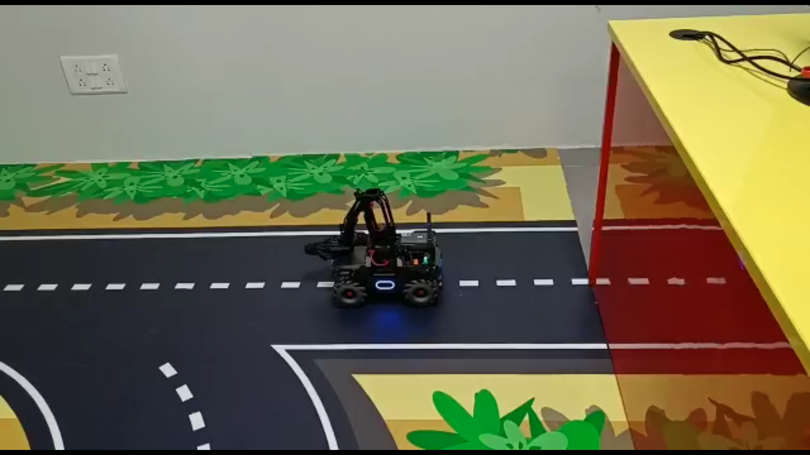
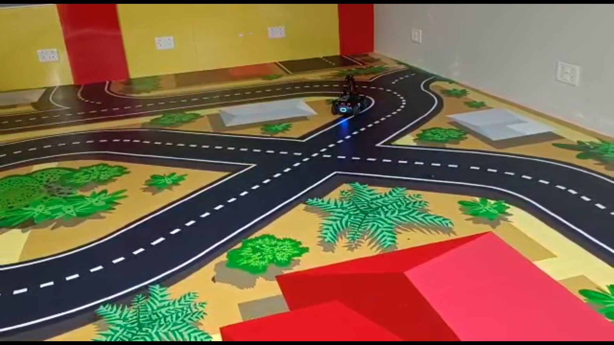

# MobileRobot-Openloopcontrol
## Aim:

To develop a python control code to move the mobilerobot along the predefined path.

## Equipments Required:
1. RoboMaster EP core
2. Python 3.7

## Procedure

### Step1:
Initiate the MobileRobot.
<br/>

### Step2:
Connect your PC with the MobileRobot.
<br/>

### Step3:
Open Python program.
<br/>

### Step4:
Program the movements of the robot using python code.
<br/>

### Step5:
Execute the python program.
<br/>

## Program
```
#Python control code to move the mobilerobot along the predefined path.
#Developed by: SRIJITH R
#Register No.: 212221240054

from robomaster import robot
import time

if _name_ == '_main_':
    ep_robot = robot.Robot()
    ep_robot.initialize(conn_type="ap")

    ep_chassis = ep_robot.chassis

    '''
    x = x-axis movement distance,( meters) [-5,5]
    y = y-axis movement distance,( meters) [-5,5]
    z = rotation about z axis ( degree)[-180,180]
    xy_speed = xy axis movement speed,( unit meter/second) [0.5,2]
    '''
    ep_chassis.move(x=2.6, y=0, z=0, xy_speed=0.75).wait_for_completed()

    ep_chassis.move(x=0, y=0, z=47, xy_speed=0.75).wait_for_completed()

    ep_chassis.move(x=2.4, y=0, z=0, xy_speed=0.75).wait_for_completed()
    
    ep_chassis.move(x=0, y=-0.2, z=0, xy_speed=0.75).wait_for_completed()

    ep_chassis.move(x=1, y=0, z=0, xy_speed=0.75).wait_for_completed()

    ep_chassis.move(x=0.6, y=-0.3, z=45, xy_speed=0.75).wait_for_completed()

    ep_chassis.move(x=0.9, y=-0.2, z=45, xy_speed=0.75).wait_for_completed()

    ep_chassis.move(x=0.5, y=-0.5, z=45, xy_speed=0.75).wait_for_completed()

    ep_chassis.move(x=1, y=-0.3, z=45, xy_speed=0.75).wait_for_completed()

    ep_chassis.move(x=0.5, y=-0.3, z=45, xy_speed=0.75).wait_for_completed()

    ep_chassis.move(x=0.5, y=-0.3, z=45, xy_speed=0.75).wait_for_completed()

    ep_chassis.move(x=0, y=0.3, z=0, xy_speed=0.75).wait_for_completed()

    ep_chassis.move(x=2.5, y=0.3, z=0, xy_speed=0.75).wait_for_completed()

    ep_robot.close()
```

## MobileRobot Movement Image:


### Initial Position:

### Final Position:

## MobileRobot Movement Video:

[[Click here.......](https://youtu.be/RsccEd7a6FE)]


## Result:
Thus the python program code is developed to move the mobilerobot in the predefined path.


```
Mobile Robotics Laboratory
Department of Artificial Intelligence and Data Science/ Machine Learning
Saveetha Engineering College
```
